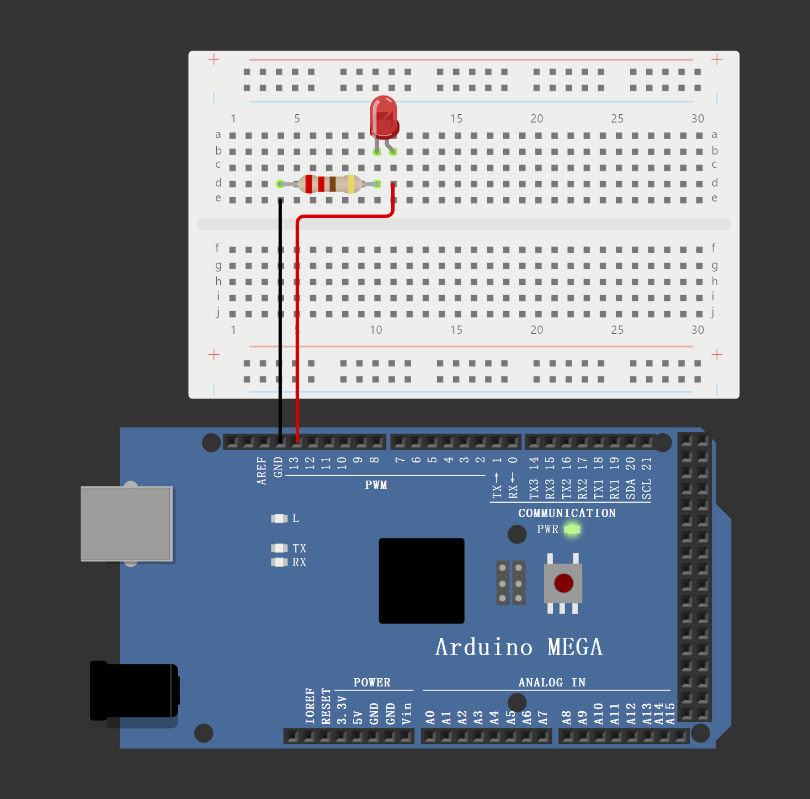

# Arduino Mega

## LED Task

### Blink once in two seconds

This code is from Prof's slides. We implemented the LED connecting to GND and Pin 13 on Arduino to replicate the expected performace.


```cpp
#define LED_PIN 13  

void setup()
{
  pinMode(LED_PIN, OUTPUT);
}

void loop()
{
  // turn the LED on (HIGH is the voltage level)
  digitalWrite(LED_PIN, HIGH);
  delay(1000); // Wait for 1000 millisecond(s)
  // turn the LED off by making the voltage LOW
  digitalWrite(LED_PIN, LOW);
  delay(1000); // Wait for 1000 millisecond(s)
}
```


<figure><figcaption><p>Blink once in two seconds</p></figcaption></figure>

### Blink twice in a second

To make the LED blink twice in a second, you need to change the delay times to 250 milliseconds. This will ensure that the LED turns on and off twice within one second. Here's the modified code:

<pre class="language-cpp" data-title="Blink twice in a second" data-line-numbers><code class="lang-cpp"><strong>#define LED_PIN 13  
</strong>
void setup()
{
  pinMode(LED_PIN, OUTPUT);
}

void loop()
{
  // turn the LED on (HIGH is the voltage level)
  digitalWrite(LED_PIN, HIGH);
  delay(250); // Wait for 250 millisecond(s)
  // turn the LED off by making the voltage LOW
  digitalWrite(LED_PIN, LOW);
  delay(250); // Wait for 250 millisecond(s)
}
</code></pre>

<figure><figcaption><p>Blink twice in a second</p></figcaption></figure>

### Blink short-short-long

To make the LED blink in a short-short-long pattern, you can define the short and long delay times and sequence the blinks accordingly. Here's how you can achieve this:


```cpp
#define LED_PIN 13  

void setup()
{
  pinMode(LED_PIN, OUTPUT);
}

void loop()
{
  // Short blink
  digitalWrite(LED_PIN, HIGH);
  delay(250); // LED on for 250 milliseconds
  digitalWrite(LED_PIN, LOW);
  delay(250); // LED off for 250 milliseconds
  
  // Another short blink
  digitalWrite(LED_PIN, HIGH);
  delay(250); // LED on for 250 milliseconds
  digitalWrite(LED_PIN, LOW);
  delay(250); // LED off for 250 milliseconds
  
  // Long blink
  digitalWrite(LED_PIN, HIGH);
  delay(1000); // LED on for 1000 milliseconds (1 second)
  digitalWrite(LED_PIN, LOW);
  delay(1000); // LED off for 1000 milliseconds (1 second)

  // Pause before repeating the sequence
  delay(1000); // Pause for 1 second before repeating the pattern
}
```


In this code:

* A short blink is achieved with 250 milliseconds on and 250 milliseconds off.
* A long blink is achieved with 1000 milliseconds on and 1000 milliseconds off.
* A 1-second pause is added after the pattern to make it more distinguishable before it repeats.

<figure><figcaption><p>Blink short-short-long</p></figcaption></figure>

### Blink randomly

To make the LED blink randomly, you can use the `random()` function in Arduino to generate random delay times. Here's an example code:


```cpp
#define LED_PIN 13  

void setup()
{
  pinMode(LED_PIN, OUTPUT);
  randomSeed(analogRead(0)); // Seed the random number generator
}

void loop()
{
  // turn the LED on (HIGH is the voltage level)
  digitalWrite(LED_PIN, HIGH);
  int onTime = random(100, 1000); // Random on time between 100 and 1000 milliseconds
  delay(onTime); 

  // turn the LED off by making the voltage LOW
  digitalWrite(LED_PIN, LOW);
  int offTime = random(100, 1000); // Random off time between 100 and 1000 milliseconds
  delay(offTime);
}

```


In this code:

* `randomSeed(analogRead(0))` initializes the random number generator with a seed value based on an analog read from pin 0, which helps to ensure the randomness each time the Arduino is reset.
* `random(100, 1000)` generates a random delay time between 100 and 1000 milliseconds for both the on and off states of the LED. You can adjust the range of the random values to fit your needs.

<figure><figcaption><p>Blink randomly</p></figcaption></figure>

## Serial Communication

we will explore serial communication with Arduino and how to improve the readability of the received data for our human users. We'll start with a basic code example and then discuss enhancements.

### Basic Serial Communication Code

Here's the initial code for serial communication:


```cpp
void setup() {
  // put your setup code here, to run once:
  Serial.begin(9600);
  Serial.println("Hello World!\n");
}

void loop() {
  // put your main code here, to run repeatedly:
  if (Serial.available()){
    int inByte = Serial.read();
    Serial.print("Read: ");
    Serial.print(inByte);
    Serial.print(" 0x");
    Serial.println(inByte, HEX);
  }
}
```


This code sets up serial communication at a baud rate of 9600 and prints "Hello World!" when the program starts. In the `loop()` function, it checks if there is any data available to read from the serial buffer. If there is, it reads the incoming byte and prints it in both decimal and hexadecimal formats.

#### Explanation and Issue

When using `Serial.read()`, the function reads incoming serial data as bytes. This means the data is represented as integer values, which might not be human-readable, especially when dealing with characters.

For example, if you send the character 'A' through the serial monitor, the program will output:

```makefile
Read: 65 0x41
```

While `65` and `0x41` (hexadecimal representation) are correct according to the [ASCII standard](https://www.ascii-code.com/), they are not immediately intuitive. We often want to see the actual character being sent for better understanding and debugging.

### Improving Readability

To make the data more human-readable, we can modify the code to print the character representation directly. Here is the improved version:


```cpp
void setup() {
  // put your setup code here, to run once:
  Serial.begin(9600);
  Serial.println("Hello World!\n");
}

void loop() {
  // put your main code here, to run repeatedly:
  if (Serial.available()){
    int inByte = Serial.read();
    Serial.print("Read: ");
    Serial.print(inByte);
    Serial.print(" (");
    Serial.print((char)inByte);
    Serial.print(") 0x");
    Serial.println(inByte, HEX);
  }
}
```


#### Enhanced Explanation

In this improved version, we added `Serial.print((char)inByte)` to print the character representation of the incoming byte. Now, when a character like 'A' is sent, the output will be more informative:

```makefile
Read: 65 (A) 0x41
```

This output shows:

* The decimal value `65`
* The corresponding character `A`
* The hexadecimal value `0x41`

## Ultrasonic Sensor

