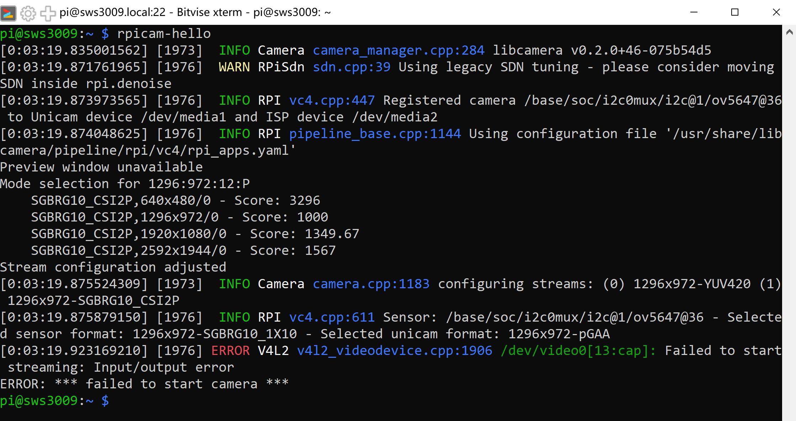

# Check Lists

<table><thead><tr><th width="219">Item</th><th width="60" align="center">Qty</th><th align="center">Image</th></tr></thead><tbody><tr><td>Arduino Mega 2560 R3</td><td align="center">1</td><td align="center"></td></tr><tr><td>Arduino L293D DC Motor Driver Shield</td><td align="center">1</td><td align="center"></td></tr><tr><td></td><td align="center"></td><td align="center"></td></tr></tbody></table>
