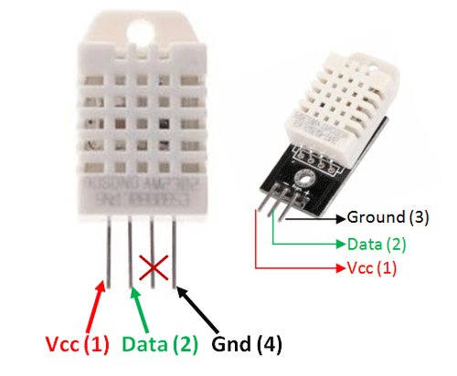

# Check Lists

<table><thead><tr><th width="219">Item</th><th width="60" align="center">Qty</th><th align="center">Image</th></tr></thead><tbody><tr><td>Arduino Mega 2560 R3</td><td align="center">1</td><td align="center"></td></tr><tr><td>Arduino L293D DC Motor Driver Shield</td><td align="center">1</td><td align="center"></td></tr><tr><td>4WD  Chassis</td><td align="center">1</td><td align="center"></td></tr><tr><td>Ultrasonic Sensor (HC-SR04)</td><td align="center">5</td><td align="center"></td></tr><tr><td>Wheel Encoder Kit</td><td align="center">2</td><td align="center"></td></tr><tr><td>MicroHDMI to HDMI (1.5 m)</td><td align="center">1</td><td align="center"></td></tr><tr><td>Logic Level Converter</td><td align="center">1</td><td align="center"></td></tr><tr><td>Raspberry Pi 4</td><td align="center">1</td><td align="center"></td></tr><tr><td>Numberpad</td><td align="center">1</td><td align="center"></td></tr><tr><td>SanDisk 16GB microSD Card</td><td align="center">1</td><td align="center"></td></tr><tr><td>Mi Power Bank 10000 mAh</td><td align="center">1</td><td align="center"></td></tr><tr><td>Plastic Container For Carrying Gear</td><td align="center">1</td><td align="center"></td></tr></tbody></table>
