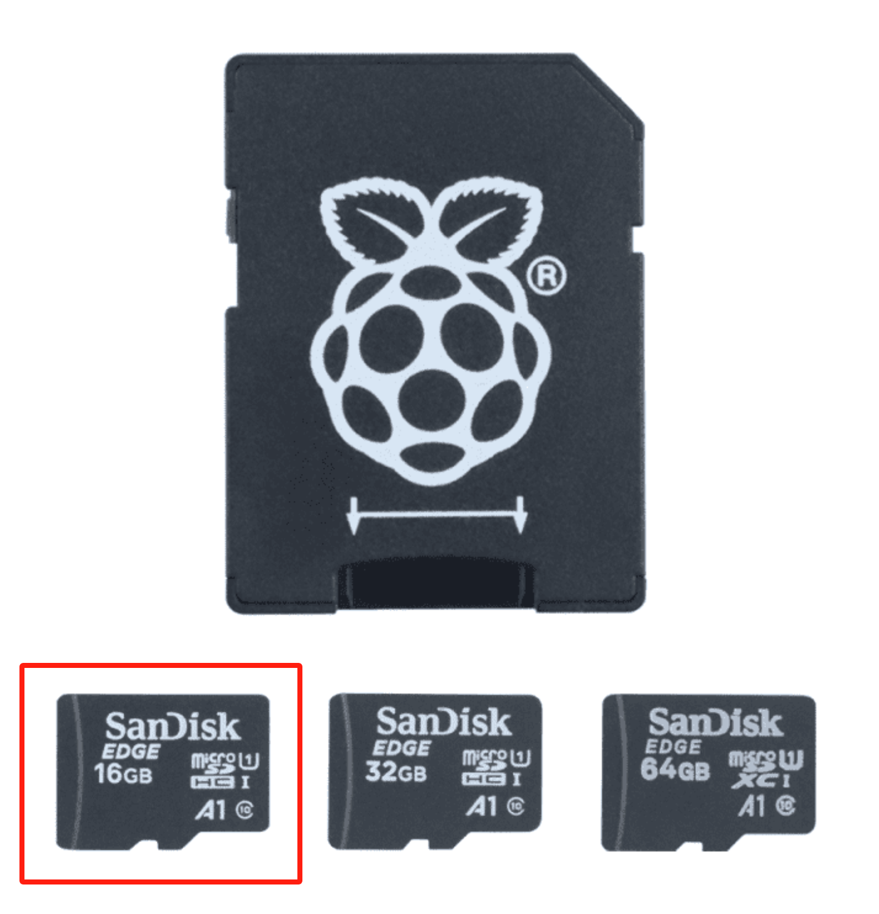

# Day 0: Check Lists

Please carefully check the quantities of the materials provided to you. The images on this page are for reference only; the actual items may vary.

## Team Material List

<table><thead><tr><th width="219">Item</th><th width="60" align="center">Qty</th><th align="center">Image</th></tr></thead><tbody><tr><td>Arduino Mega 2560 R3</td><td align="center">1</td><td align="center"></td></tr><tr><td>Arduino L293D DC Motor Driver Shield</td><td align="center">1</td><td align="center"></td></tr><tr><td>4WD  Chassis</td><td align="center">1</td><td align="center"></td></tr><tr><td>Ultrasonic Sensor (HC-SR04)</td><td align="center">5</td><td align="center"></td></tr><tr><td>Wheel Encoder Kit</td><td align="center">2</td><td align="center"></td></tr><tr><td>MicroHDMI to HDMI (1.5 m)</td><td align="center">1</td><td align="center"></td></tr><tr><td>Logic Level Converter</td><td align="center">1</td><td align="center"></td></tr><tr><td>Raspberry Pi 4</td><td align="center">1</td><td align="center"></td></tr><tr><td>Numberpad</td><td align="center">1</td><td align="center"></td></tr><tr><td>SanDisk 16GB microSD Card</td><td align="center">1</td><td align="center"></td></tr><tr><td>Mi Power Bank 10000 mAh</td><td align="center">1</td><td align="center"></td></tr><tr><td>Plastic Container For Carrying Gear</td><td align="center">1</td><td align="center"></td></tr><tr><td>Breadboard (400 points)</td><td align="center">2</td><td align="center"></td></tr><tr><td>Breadboard (mini)</td><td align="center">2</td><td align="center"></td></tr><tr><td>Male to Male Wire (20 pc 200mm)</td><td align="center">1</td><td align="center"></td></tr><tr><td>Female to Female Wire (20 pc 200mm)</td><td align="center">1</td><td align="center"></td></tr><tr><td>Male to Female Wire (20 pc 200mm)</td><td align="center">1</td><td align="center"></td></tr><tr><td>Sensor Box (Misc Sensor hardware)</td><td align="center">1</td><td align="center"></td></tr><tr><td>Colour Sensor</td><td align="center">1</td><td align="center"></td></tr><tr><td>RPi Camera</td><td align="center">1</td><td align="center"></td></tr><tr><td>Screwdriver Set</td><td align="center">1</td><td align="center"></td></tr><tr><td>Wire Cutter</td><td align="center">1</td><td align="center"></td></tr><tr><td>Wire  Stripper</td><td align="center">1</td><td align="center"></td></tr><tr><td>Single Core Wire (one red one black, 20AWG)</td><td align="center">1</td><td align="center"></td></tr><tr><td>Protoboard</td><td align="center">2</td><td align="center"></td></tr><tr><td>8 * AA Holder with Cover</td><td align="center">1</td><td align="center"></td></tr><tr><td>Charger</td><td align="center">2</td><td align="center"></td></tr><tr><td>Batteries: AA 3000 (2 pcs)</td><td align="center">4</td><td align="center"></td></tr><tr><td>HDMI USB 2.0</td><td align="center">1</td><td align="center"></td></tr><tr><td>SD Card Reader/Writer (5 port 15 cm)</td><td align="center">1</td><td align="center"></td></tr><tr><td>Electronic Parts Pack</td><td align="center">1</td><td align="center"></td></tr><tr><td>Motors</td><td align="center">4</td><td align="center"></td></tr><tr><td>Wheels</td><td align="center">4</td><td align="center"></td></tr><tr><td>RPi Case (T-A)</td><td align="center">1</td><td align="center"></td></tr><tr><td>IMU (MPU6500)</td><td align="center">1</td><td align="center"></td></tr></tbody></table>

## Personal Material List

<table><thead><tr><th width="222">Item</th><th width="60" align="center">Qty</th><th align="center">Image</th></tr></thead><tbody><tr><td>Mounting Tape (20MM)</td><td align="center">1</td><td align="center"></td></tr><tr><td>Zip Ties (black, 100mm x 2.5mm)</td><td align="center">10</td><td align="center"></td></tr></tbody></table>

Please handle and use your materials safely! We look forward to seeing the fantastic work you create with them!
