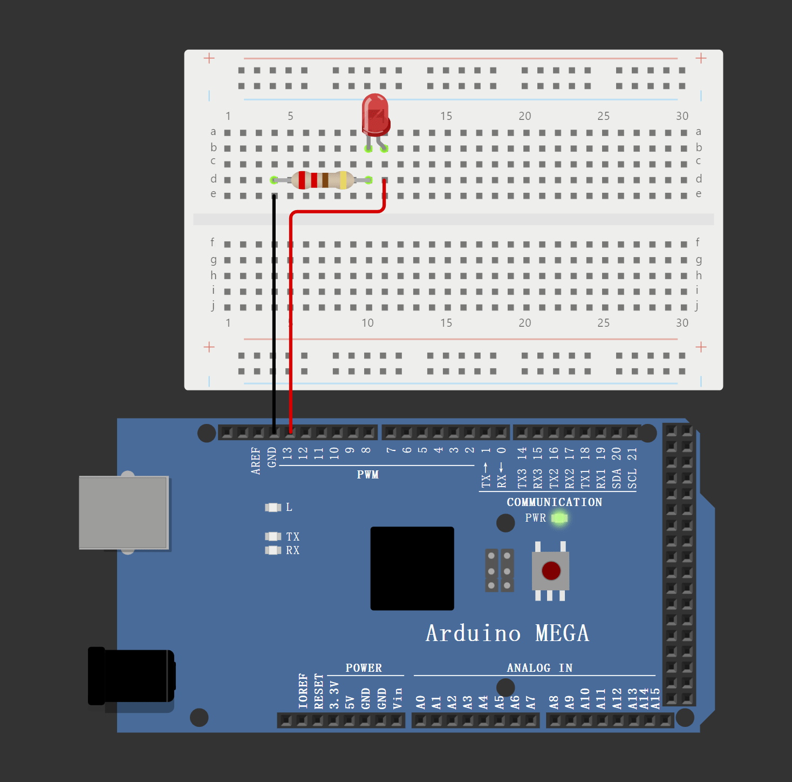

# Day 2: Arduino Mega

This material is designed as supplementary to the Day 2 Slides. You should not use this material without first reading the slides and trying out by yourself. Instead, refer to this material only if you encounter issues or bugs while following the slides.

## LED Task

### Blink once in two seconds

This code is from Prof's slides. We implemented the LED connecting to GND and Pin 13 on Arduino to replicate the expected performace.

<pre class="language-cpp" data-title="Blink once in two seconds" data-line-numbers data-full-width="false"><code class="lang-cpp">#define LED_PIN 13  
<strong>
</strong>void setup()
{
  pinMode(LED_PIN, OUTPUT);
}

void loop()
{
  // turn the LED on (HIGH is the voltage level)
  digitalWrite(LED_PIN, HIGH);
  delay(1000); // Wait for 1000 millisecond(s)
  // turn the LED off by making the voltage LOW
  digitalWrite(LED_PIN, LOW);
  delay(1000); // Wait for 1000 millisecond(s)
}
</code></pre>

<figure><figcaption><p>Blink once in two seconds</p></figcaption></figure>

### Blink twice in a second

To make the LED blink twice in a second, you need to change the delay times to 250 milliseconds. This will ensure that the LED turns on and off twice within one second. Here's the modified code:

<pre class="language-cpp" data-title="Blink twice in a second" data-line-numbers><code class="lang-cpp"><strong>#define LED_PIN 13  
</strong>
void setup()
{
  pinMode(LED_PIN, OUTPUT);
}

void loop()
{
  // turn the LED on (HIGH is the voltage level)
  digitalWrite(LED_PIN, HIGH);
  delay(250); // Wait for 250 millisecond(s)
  // turn the LED off by making the voltage LOW
  digitalWrite(LED_PIN, LOW);
  delay(250); // Wait for 250 millisecond(s)
}
</code></pre>

<figure><figcaption><p>Blink twice in a second</p></figcaption></figure>

### Blink short-short-long

To make the LED blink in a short-short-long pattern, you can define the short and long delay times and sequence the blinks accordingly. Here's how you can achieve this:


```cpp
#define LED_PIN 13  

void setup()
{
  pinMode(LED_PIN, OUTPUT);
}

void loop()
{
  // Short blink
  digitalWrite(LED_PIN, HIGH);
  delay(250); // LED on for 250 milliseconds
  digitalWrite(LED_PIN, LOW);
  delay(250); // LED off for 250 milliseconds
  
  // Another short blink
  digitalWrite(LED_PIN, HIGH);
  delay(250); // LED on for 250 milliseconds
  digitalWrite(LED_PIN, LOW);
  delay(250); // LED off for 250 milliseconds
  
  // Long blink
  digitalWrite(LED_PIN, HIGH);
  delay(1000); // LED on for 1000 milliseconds (1 second)
  digitalWrite(LED_PIN, LOW);
  delay(1000); // LED off for 1000 milliseconds (1 second)

  // Pause before repeating the sequence
  delay(1000); // Pause for 1 second before repeating the pattern
}
```


In this code:

* A short blink is achieved with 250 milliseconds on and 250 milliseconds off.
* A long blink is achieved with 1000 milliseconds on and 1000 milliseconds off.
* A 1-second pause is added after the pattern to make it more distinguishable before it repeats.

<figure><figcaption><p>Blink short-short-long</p></figcaption></figure>

### Blink randomly

To make the LED blink randomly, you can use the `random()` function in Arduino to generate random delay times. Here's an example code:


```cpp
#define LED_PIN 13  

void setup()
{
  pinMode(LED_PIN, OUTPUT);
  randomSeed(analogRead(0)); // Seed the random number generator
}

void loop()
{
  // turn the LED on (HIGH is the voltage level)
  digitalWrite(LED_PIN, HIGH);
  int onTime = random(100, 1000); // Random on time between 100 and 1000 milliseconds
  delay(onTime); 

  // turn the LED off by making the voltage LOW
  digitalWrite(LED_PIN, LOW);
  int offTime = random(100, 1000); // Random off time between 100 and 1000 milliseconds
  delay(offTime);
}

```


In this code:

* `randomSeed(analogRead(0))` initializes the random number generator with a seed value based on an analog read from pin 0, which helps to ensure the randomness each time the Arduino is reset.
* `random(100, 1000)` generates a random delay time between 100 and 1000 milliseconds for both the on and off states of the LED. You can adjust the range of the random values to fit your needs.

<figure><figcaption><p>Blink randomly</p></figcaption></figure>

## Serial Communication

we will explore serial communication with Arduino and how to improve the readability of the received data for our human users. We'll start with a basic code example and then discuss enhancements.

### Basic Serial Communication Code

Here's the initial code for serial communication:


```cpp
void setup() {
  // put your setup code here, to run once:
  Serial.begin(9600);
  Serial.println("Hello World!\n");
}

void loop() {
  // put your main code here, to run repeatedly:
  if (Serial.available()){
    int inByte = Serial.read();
    Serial.print("Read: ");
    Serial.print(inByte);
    Serial.print(" 0x");
    Serial.println(inByte, HEX);
  }
}
```


This code sets up serial communication at a baud rate of 9600 and prints "Hello World!" when the program starts. In the `loop()` function, it checks if there is any data available to read from the serial buffer. If there is, it reads the incoming byte and prints it in both decimal and hexadecimal formats.

#### Explanation and Issue

When using `Serial.read()`, the function reads incoming serial data as bytes. This means the data is represented as integer values, which might not be human-readable, especially when dealing with characters.

For example, if you send the character 'A' through the serial monitor, the program will output:

```makefile
Read: 65 0x41
```

While `65` and `0x41` (hexadecimal representation) are correct according to the [ASCII standard](https://www.ascii-code.com/), they are not immediately intuitive. We often want to see the actual character being sent for better understanding and debugging.

### Improving Readability

To make the data more human-readable, we can modify the code to print the character representation directly. Here is the improved version:


```cpp
void setup() {
  // put your setup code here, to run once:
  Serial.begin(9600);
  Serial.println("Hello World!\n");
}

void loop() {
  // put your main code here, to run repeatedly:
  if (Serial.available()){
    int inByte = Serial.read();
    Serial.print("Read: ");
    Serial.print(inByte);
    Serial.print(" (");
    Serial.print((char)inByte);
    Serial.print(") 0x");
    Serial.println(inByte, HEX);
  }
}
```


#### Enhanced Explanation

In this improved version, we added `Serial.print((char)inByte)` to print the character representation of the incoming byte. Now, when a character like 'A' is sent, the output will be more informative:

```makefile
Read: 65 (A) 0x41
```

This output shows:

* The decimal value `65`
* The corresponding character `A`
* The hexadecimal value `0x41`

## Ultrasonic Sensor

### Equivalent Code without Library


```cpp
const int trigPin = 12;
const int echoPin = 11;

float duration, distance;

void setup() {
  pinMode(trigPin, OUTPUT);
  pinMode(echoPin, INPUT);
  Serial.begin(9600);
}

void loop() {
  digitalWrite(trigPin, LOW);
  delayMicroseconds(2);
  digitalWrite(trigPin, HIGH);
  delayMicroseconds(10);
  digitalWrite(trigPin, LOW);

  duration = pulseIn(echoPin, HIGH);
  distance = (duration*.0343)/2;
  Serial.print("Distance: ");
  Serial.println(distance);
  delay(100);
}
```


<figure><figcaption><p>Ultrasonic Sensor Demo</p></figcaption></figure>

### Equivalent Code with using Library

You should download and implement the library in Arduino IDE in prior:

* Download NewPing.h from: [https://www.arduino.cc/reference/en/libraries/newping/](https://www.arduino.cc/reference/en/libraries/newping/)
* Include the ZIP library in Arduino IDE: Sketch > Include Library > Add.ZIP Libraries

<figure><figcaption><p>Sketch > Include Library > Add.ZIP Libraries</p></figcaption></figure>

Here is the code in your hands out, after including the headfiles, the code can be compiled correctly.


```cpp
#include <NewPing.h>

#define TRIGGER_PIN  13  // Arduino pin tied to trigger pin on the ultrasonic sensor.
#define ECHO_PIN     12  // Arduino pin tied to echo pin on the ultrasonic sensor.
#define MAX_DISTANCE 200 // Maximum distance we want to ping for (in centimeters). Maximum sensor distance is rated at 400-500cm.

NewPing sonar(TRIGGER_PIN, ECHO_PIN, MAX_DISTANCE); // NewPing setup of pins and maximum distance.

void setup() {
  Serial.begin(115200); // Open serial monitor at 115200 baud to see ping results.
}

void loop() {
  delay(50);                     // Wait 50ms between pings (about 20 pings/sec). 29ms should be the shortest delay between pings.
  Serial.print("Ping: ");
  Serial.print(sonar.ping_cm()); // Send ping, get distance in cm and print result (0 = outside set distance range)
  Serial.println("cm");
}
```


## DC Motor

### LED Blinky


```cpp
int ledPin = 9;    // LED connected to digital pin 9
int brightness = 0; // Initial brightness
int fadeAmount = 15; // Amount to change the brightness

void setup() {
  pinMode(ledPin, OUTPUT); // Set ledPin as an output
}

void loop() {
  analogWrite(ledPin, brightness); // Set the brightness using PWM

  brightness = brightness + fadeAmount; // Increase brightness

  // Reverse the direction of the brightness change
  if (brightness <= 0 || brightness >= 255) {
    fadeAmount = -fadeAmount;
  }

  delay(30); // Delay for 30 milliseconds to control the speed of the change
}
```


<figure><figcaption><p>LED Blinky using PWM</p></figcaption></figure>

### Additional Challenge

Write a program to control the brightness of LED using Serial Communication:

```cpp
// Define the LED pin
const int ledPin = 13; // PWM pin
int brightness = 0;

void setup() {
  // Initialize the LED pin as an output
  pinMode(ledPin, OUTPUT);
  
  // Initialize serial communication at 9600 bits per second
  Serial.begin(9600);
  Serial.println("Serial Begin!");
}

void loop() {
  // Check if any data is available to read
  if (Serial.available() > 0) {
    // Read the first incoming character
    char startChar = Serial.read();
    
    // Check if it is a valid start character (assuming 'B' indicates the start of a brightness value)
    if (startChar == 'B') {
      // Read the following integer value
      int newBrightness = Serial.parseInt();
      
      // Ensure the brightness value is within the valid range
      newBrightness = constrain(newBrightness, 0, 255);
      
      // Update the brightness and set the LED brightness
      brightness = newBrightness;
      analogWrite(ledPin, brightness);
      
      // Print the received brightness value to the Serial Monitor
      Serial.print("LED Brightness: ");
      Serial.println(brightness);
    }
  }
}

```

This way, the brightness will only be updated when a valid input starting with 'B' is received, avoiding unintentional changes when no new data is present.

<figure><figcaption><p>Control the brightness of LED using Serial Communication</p></figcaption></figure>

## Challenge Questions

### Ultrasonic & Interrupt

Can you use an interrupt to turn on an LED based on the distance measured by the ultrasonic sensor?

```cpp
const int trigPin = 12;
const int echoPin = 2; // Using pin 2 for interrupt
const int ledPin1 = 7;
const int ledPin2 = 8;
const float thresholdDistance = 100.0; // Threshold distance in cm

volatile unsigned long pulseStart;
volatile unsigned long pulseEnd;
volatile bool newMeasurement = false;

void setup() {
  pinMode(trigPin, OUTPUT);
  pinMode(echoPin, INPUT);
  pinMode(ledPin1, OUTPUT);
  pinMode(ledPin2, OUTPUT);
  Serial.begin(9600);

  // Attach interrupt to echo pin
  attachInterrupt(digitalPinToInterrupt(echoPin), echoISR, CHANGE);
}

void loop() {
  static unsigned long lastTriggerTime = 0;

  // Trigger the ultrasonic sensor every 100ms
  if (millis() - lastTriggerTime >= 100) {
    // Trigger the ultrasonic sensor
    digitalWrite(trigPin, LOW);
    delayMicroseconds(2);
    digitalWrite(trigPin, HIGH);
    delayMicroseconds(10);
    digitalWrite(trigPin, LOW);
    
    lastTriggerTime = millis(); // Reset the timer
  }

  if (newMeasurement) {
    newMeasurement = false;
    unsigned long duration = pulseEnd - pulseStart;
    float distance = (duration * 0.0343) / 2;

    // Print the distance to the Serial Monitor
    Serial.print("Distance: ");
    Serial.println(distance);

    // Update the LED state based on the measured distance
    if (distance < thresholdDistance) {
      digitalWrite(ledPin1, HIGH);
      digitalWrite(ledPin2, LOW);
    } else {
      digitalWrite(ledPin1, LOW);
      digitalWrite(ledPin2, HIGH);
    }
  }
}

void echoISR() {
  if (digitalRead(echoPin) == HIGH) {
    // Rising edge: record the start time
    pulseStart = micros();
  } else {
    // Falling edge: record the end time and set flag
    pulseEnd = micros();
    newMeasurement = true;
  }
}
```

<figure><figcaption><p>Using ISR to detect new distance values from Ultrasonic Sensor</p></figcaption></figure>

### Joystic

<pre class="language-cpp"><code class="lang-cpp">const int joystickXPin = A0; // Joystick X
const int joystickYPin = A1; // Joystick Y
const int joystickButtonPin = 2; // Joystick Btn
const int ledPins[] = {11, 12, 9, 10, 13};
const int rgbLedPins[] = {9, 8, 7};

// States
<strong>int joystickXValue = 0;
</strong>int joystickYValue = 0;
bool buttonPressed = false;
int currentColorIndex = 0;
unsigned long lastDebounceTime = 0;
unsigned long debounceDelay = 100;    // Debouncing

void setup() {
  Serial.begin(9600);

  for (int i = 0; i &#x3C; 5; i++) {
    pinMode(ledPins[i], OUTPUT);
  }

  for (int i = 0; i &#x3C; 3; i++) {
    pinMode(rgbLedPins[i], OUTPUT);
  }

  pinMode(joystickButtonPin, INPUT_PULLUP);
  attachInterrupt(digitalPinToInterrupt(joystickButtonPin), joystickButtonISR, FALLING);
}

void loop() {
  joystickXValue = analogRead(joystickXPin);
  joystickYValue = analogRead(joystickYPin);

  Serial.print("X: ");
  Serial.print(joystickXValue);
  Serial.print(" Y: ");
  Serial.print(joystickYValue);
  Serial.print(" Button: ");
  Serial.println(buttonPressed ? "Pressed" : "Not Pressed");

  controlLEDs();

  delay(100);
}

void controlLEDs() {
  for (int i = 0; i &#x3C; 5; i++) {
    analogWrite(ledPins[i], 0);
  }

  // Center?
  if (joystickXValue > 450 &#x26;&#x26; joystickXValue &#x3C; 550 &#x26;&#x26; joystickYValue > 450 &#x26;&#x26; joystickYValue &#x3C; 550) {
    return;
  }

  int xDiff = abs(joystickXValue - 512);
  int yDiff = abs(joystickYValue - 512);

  if (xDiff > yDiff) {
    if (joystickXValue &#x3C; 450) {
      analogWrite(ledPins[1], map(450 - joystickXValue, 0, 450, 0, 255)); // Up LED
    } else if (joystickXValue > 550) {
      analogWrite(ledPins[3], map(joystickXValue - 550, 0, 450, 0, 255)); // Dw LED
    }
  } else {
    if (joystickYValue &#x3C; 450) {
      analogWrite(ledPins[0], map(450 - joystickYValue, 0, 450, 0, 255)); // Lf LED
    } else if (joystickYValue > 550) {
      analogWrite(ledPins[4], map(joystickYValue - 550, 0, 450, 0, 255)); // Rt LED
    }
  }
}

void joystickButtonISR() {
  unsigned long currentTime = millis();
  if ((currentTime - lastDebounceTime) > debounceDelay) {
    toggleRGBLed();
    lastDebounceTime = currentTime;
  }
}

void toggleRGBLed() {
  static int colorIndex = 0;

  // Off
  for (int i = 0; i &#x3C; 3; i++) {
    digitalWrite(rgbLedPins[i], LOW);
  }

  // Update Led
  colorIndex = (colorIndex + 1) % 3;
  digitalWrite(rgbLedPins[colorIndex], HIGH);
}
</code></pre>

<figure><figcaption><p>Joystic Controller Design (with Debouncing)</p></figcaption></figure>
