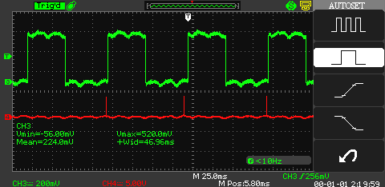
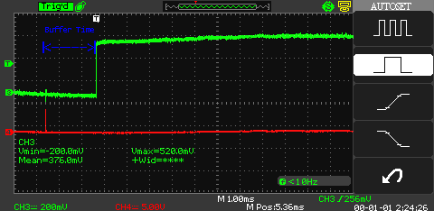
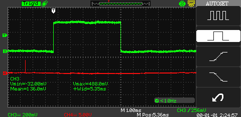
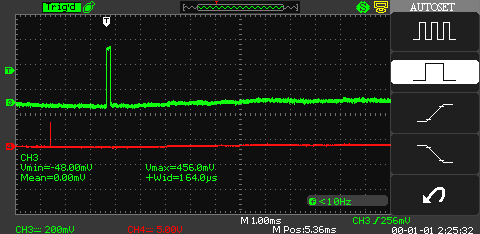
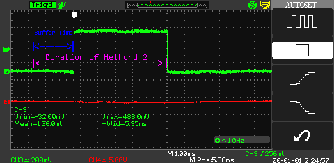
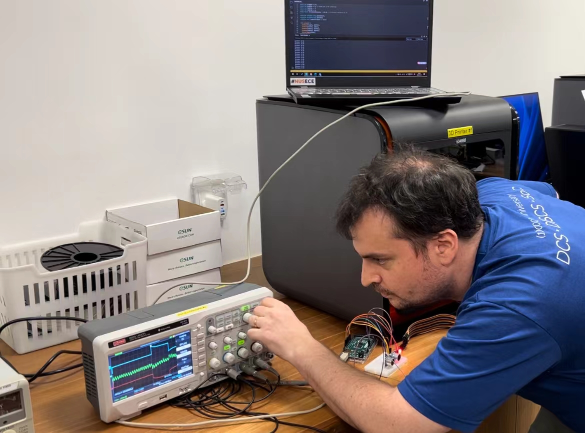

# Day 2.1: Ultrasonic Sensor

We appreciate the students who challenged ideas on the afternoon of Day 2. The SWS3009B Teaching teams researched after work and finally got a clear idea about our new Ultrasonic Sensor (HC-SR04A).

## Code Explaination

In Day 2's lecture, we used an example code which is provided by the manufacturer of the HC-SR04A; the main methodology **(we will call this Method 1)** is like this:

### Method 1


```cpp
  digitalWrite(trigPin, LOW);
  delayMicroseconds(2);
  digitalWrite(trigPin, HIGH);
  delayMicroseconds(10);
  digitalWrite(trigPin, LOW);

  duration = pulseIn(echoPin, HIGH);
  distance = (duration*.0343)/2;
```


Here is the code explanation: <mark style="color:purple;">**The third and fourth lines**</mark> of code generate a 10us high pulse to trigger the `trigPin`, causing the ultrasonic transmitter to send out eight 40KHz ultrasonic pulses _(source: manufacturer)_. <mark style="color:purple;">**The first and second lines**</mark> are just to ensure the pulse is off and have no effect. <mark style="color:purple;">**The fifth line**</mark> of code turns off the pulse. The `pulseIn(echoPin, HIGH)` function in <mark style="color:purple;">**the seventh line of code**</mark> is used to detect the duration of the high-level signal on the `echoPin`, measured in microseconds (us). According to the manufacturer's manual, the duration of the high-level signal on the `echoPin` (i.e., the width of the echo pulse) represents the time it takes for the ultrasonic pulse to travel from the transmitter to the receiver. Thus, the formula in the <mark style="color:purple;">**eighth line of code**</mark> is: `distance = (duration * 0.0343) / 2`.

Here, duration is the width of the echo pulse, and 0.0343 cm/us is the speed of sound in the air. We divide by 2 because this time includes the round trip of the ultrasonic pulse from the sensor to the object and back.

**Therefore, the width of the echo pulse is directly related to the distance: the farther the distance, the wider the echo pulse; the closer the distance, the narrower the echo pulse.**

### Method 2

Many students wonder why using a completely different logic to measure distance can also be successful: that is **(we will call this Method 2)**, recording the duration between the `trigPin` sending the pulse and the `echoPin` receiving the pulse, and then using the same formula, `distance = (duration * 0.0343) / 2`, can also yield an accurate distance?&#x20;

Below is our verification of the HC-SR04A sensor's functionality using an oscilloscope, which we hope will clarify your doubts.

## Verification of Signal Waveform from HC-SR04A

We connected the sensor's <mark style="color:red;">`trigPin`</mark> <mark style="color:red;"></mark><mark style="color:red;">to the red channel</mark> and the <mark style="color:green;">`echoPin`</mark> <mark style="color:green;"></mark><mark style="color:green;">to the green channel</mark>, then ran the code in [Method 1](day-2.1-ultrasonic-sensor.md#method-1), resulting in the following output as shown in the figure:

<figure><figcaption><p>Main Time Base = 25ms, real distance = infinite, calculated distance = 806 cm</p></figcaption></figure>

As consistent with our [Code Explanation](day-2.1-ultrasonic-sensor.md#code-explaination), we can see that a pulse signal is sent to the <mark style="color:red;">`trigPin`</mark> before the rising edge on the <mark style="color:green;">`echoPin`</mark>. Following this signal, there is a blind time (a buffer time allocated by the manufacturer for the hardware to send the pulse, _source: manufacturer_). After this period, the hardware should have emitted the ultrasonic wave, so the <mark style="color:green;">`echoPin`</mark>, as designed, turns high. We can reduce the _Main Time Base (typically denoted as seconds per division (s/div))_ and zoom in on the image to take a closer look:

<figure><figcaption><p>Main Time Base = 1ms, real distance = infinite, calculated distance = 806 cm</p></figcaption></figure>

When the distance of the ultrasonic wave is reduced to 100 cm (as per the [code from Day 2](day-2-arduino-mega.md#ultrasonic-and-interrupt), where the red light turns on), the resulting waveform looks like this:

<figure><figcaption><p>Main Time Base = 1ms, real distance = calculated distance = 100 cm</p></figcaption></figure>

When the distance of the ultrasonic wave is reduced to 2 cm (the theoretical minimum detection distance), the resulting waveform looks like this:

<figure><figcaption><p>Main Time Base = 1ms, real distance = calculated distance = 2 cm</p></figcaption></figure>

This validates the design principle of the HC-SR04 and confirms that the code design in [**Method 1**](day-2.1-ultrasonic-sensor.md#method-1) is correct. However, using [**Method 2**](day-2.1-ultrasonic-sensor.md#method-2), we can still obtain **accurate results**:

&#x20;When measuring the duration between the <mark style="color:red;">`trigPin`</mark> and the <mark style="color:green;">`echoPin`</mark>, if the end condition for the duration is the **falling edge** of the <mark style="color:green;">`echoPin`</mark>, the duration obtained by the students through this method will also be linearly proportional to the detection distance. If students use [**Method 2**](day-2.1-ultrasonic-sensor.md#method-2) but the end condition for the duration is the **rising edge** of the <mark style="color:green;">`echoPin`</mark>, the duration obtained will be a fixed value (buffer time), which could be wrong. Below is a diagram showing the difference in duration detected by the two methods in [**Method 2**](day-2.1-ultrasonic-sensor.md#method-2):

<figure><figcaption><p>Main Time Base = 1ms, real distance = calculated distance = 100 cm</p></figcaption></figure>

We hope this clarifies your doubts. Additionally, regarding the issue we encountered this afternoon where the waveforms of the <mark style="color:red;">`trigPin`</mark> and the <mark style="color:green;">`echoPin`</mark> were exactly opposite, we found after repeated verification that it was caused by a **malfunction in the oscilloscope's Channel 2**. We have reported this for repair.

<figure><figcaption><p>the 'mirrored' waveform! So confusing!</p></figcaption></figure>

<mark style="background-color:purple;">**Thank you all for raising questions. The teaching team has also learned a lot and reflected on many things during the teaching process. It has been a very rewarding experience for us! :-)**</mark>
