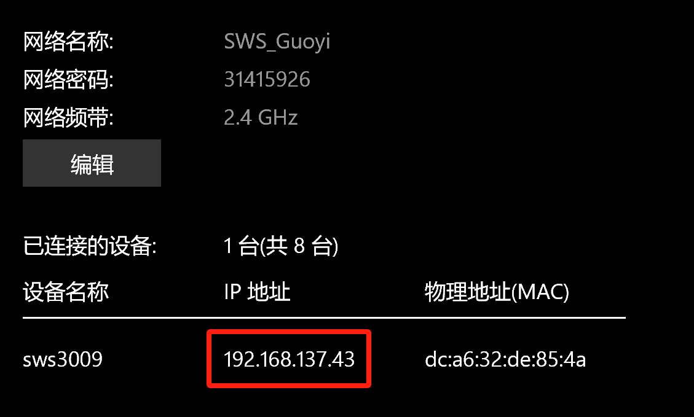
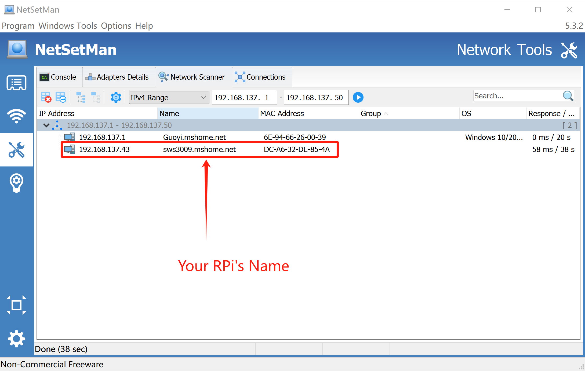
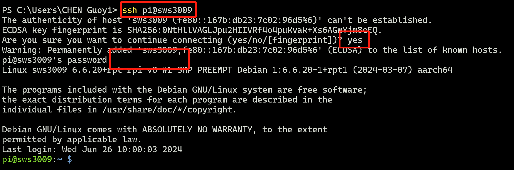
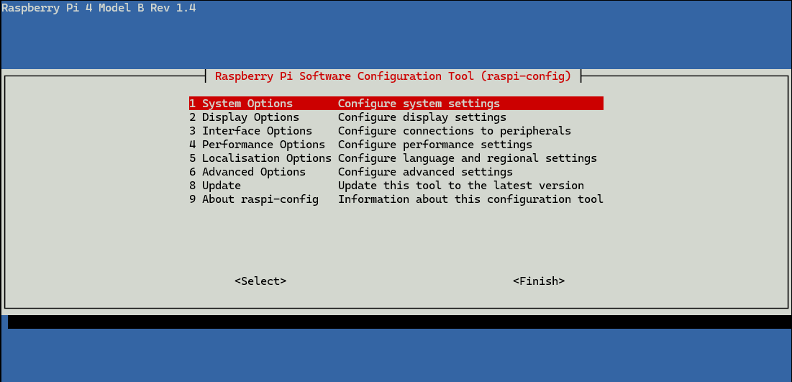

# Pi Setup Guide

This material is designed as supplementary to the Day 1 Lab Handout. You should not use this material without first reading the handout. Instead, refer to this material only if you encounter issues or bugs while following the handout.

## <mark style="color:purple;">Milestone C4</mark>

### <mark style="color:purple;">C1.10</mark> Ensuring WiFi Configuration on Your Raspberry Pi

While writing the image to the SD card, ensure your WiFi configurations are correct. Your Raspberry Pi should be able to connect to WiFi upon its initial power-up.&#x20;

### <mark style="color:purple;">C2.2</mark> Looking for the IP address of Raspberry Pi

If you are using a Windows 10/11 or macOS hotspot to provide WiFi, you can easily view the IP address of your Raspberry Pi (2.4GHz).

<figure><figcaption><p>Win10 Hotspot Config Page</p></figcaption></figure>

Although the Raspberry Pi 4 can connect to 5.0GHz WiFi, the 2.4GHz band offers higher compatibility with the Raspberry Pi.

If you are using an iPhone hotspot, you may be unable to get the IP address of your Raspberry Pi directly. In this case, use [NetSetMan](https://www.netsetman.com/en/freeware) to enumerate the devices connected to your iPhone and find the IP address of your Raspberry Pi. (Ensure your PC is connected to the iPhone's hotspot!)

<figure><figcaption><p>NetSetMan's Screenshot</p></figcaption></figure>

### <mark style="color:purple;">C3</mark> Using SSH to skip the Setting Up using GUI

If you cannot use the GUI mode of the Raspberry Pi or do not have a keyboard or mouse as peripherals, you can use SSH to configure your Raspberry Pi.

Ensure that in C1.10, you have enabled SSH in the OS Customisation section of the Raspberry Pi Imager.

To use SSH, you need to connect your PC and Raspberry Pi to the same network and know the IP address or the hostname of your Raspberry Pi.

```shell-session
ssh <username>@<RPi's name/RPi's IP Address>
```

for me, the SSH command is `ssh pi@sws3009` or `ssh pi@192.168.137.43`.

You should enable fingerprint check and enter the correct password for your Raspberry Pi. For security reasons, you will not see what you type during the password entry session.

<figure><figcaption><p>SSH Connection to Raspberry Pi</p></figcaption></figure>

Then, run `sudo raspi-config`, and click Enter, you should see a blue screen with options in a grey box:

<figure><figcaption><p>Raspberry Pi 4 Configuration Tool</p></figcaption></figure>

Use the **Up** and **Down** arrow keys to move the highlighted selection between the options available.

Press the **Right** arrow key or press **Tab** to access the `<Select>` and `<Finish>` buttons. Press **Left** or press **Tab** to return to the options.

Select the "Interfaces" tab and enable:&#x20;

* <mark style="color:orange;">Camera\*</mark>
* SSH (you should have enabled)
* VNC

<mark style="color:orange;">If you did not see the camera at this stage, it is OK! We will guide you in next stage.</mark>

You should reboot your Raspberry Pi after changing the above configurations,  run `sudo reboot` to restart your Raspberry Pi.

### <mark style="color:purple;">C4.6</mark> VNC Setting Up

Please download VNC from: [https://www.realvnc.com/en/connect/download/](https://www.realvnc.com/en/connect/download/)

&#x20;If you encounter the “**Cannot currently show the desktop**” error while using VNC, you can resolve this issue by editing the `boot/config.txt` file on your Raspberry Pi. Please read the section 2 at: [https://www.comp.nus.edu.sg/\~guoyi/tutorial/cg2111a/ros-setup/](https://www.comp.nus.edu.sg/\~guoyi/tutorial/cg2111a/ros-setup/).

## <mark style="color:purple;">Milestone C6</mark>

### <mark style="color:purple;">C6.1</mark> Running `rpicam-hello`

You should see if your RPi Camera can work correctly:

<figure><figcaption><p>Bitvise Terminal (expected output)</p></figcaption></figure>

However, if you see the following outputs, meaning your RPi Camera did NOT set up correctly yet.

<figure><figcaption><p>Bitvise Terminal (wrong response)</p></figcaption></figure>

### <mark style="color:purple;">Set Up RPi Camera</mark>

Unplug the power supply of the Raspberry Pi and unplug the RPi camera from your Raspberry Pi.&#x20;

Plug in the Camera wire, note the metal surface should face to the SD Card end of your Raspberry Pi. Then power the Raspberry Pi.

Run `vcgencmd get_camera` in the terminal, we expect the answer is:

```
supported=1 detected=1......
```

If you see this response, meaning your RPi Camera is ready and you can resume your work from <mark style="color:purple;">**C6.1**</mark>.

However, if you see something like:

```
supported=0 detected=0, libcamera interfaces=0
```

Meaning that your Raspberry Pi is unable to detect and support the camera, we should manually add some code in configuration file:

1.  Open the terminal and enter the following command:

    ```bash
    sudo nano /boot/config.txt
    ```


2.  Then add the following lines to the file:

    ```txt
    start_x=1
    gpu_mem=128
    ```

    Save the file and exit (press `Ctrl+X`, then press `Y`, and finally press `Enter`).
3.  **Restart the Raspberry Pi**: To apply the changes, restart your Raspberry Pi:

    ```bash
    sudo reboot
    ```

After restarting, you can test if the Pi Camera is working correctly by running the following command:

```bash
vcgencmd get_camera
```

If the camera is enabled correctly, you should see the following output:

```txt
supported=1 detected=1
```

You can resume your work from <mark style="color:purple;">**C6.1**</mark>.

### <mark style="color:purple;">C6.2</mark> Running `rpicam-jpeg --output test.jpg`

By running the above commandm, you should see the following outputs from the terminal:

<figure><figcaption><p>Bitvise Terminal</p></figcaption></figure>

You may see the test picture from `/home/pi/test.jpg`.

